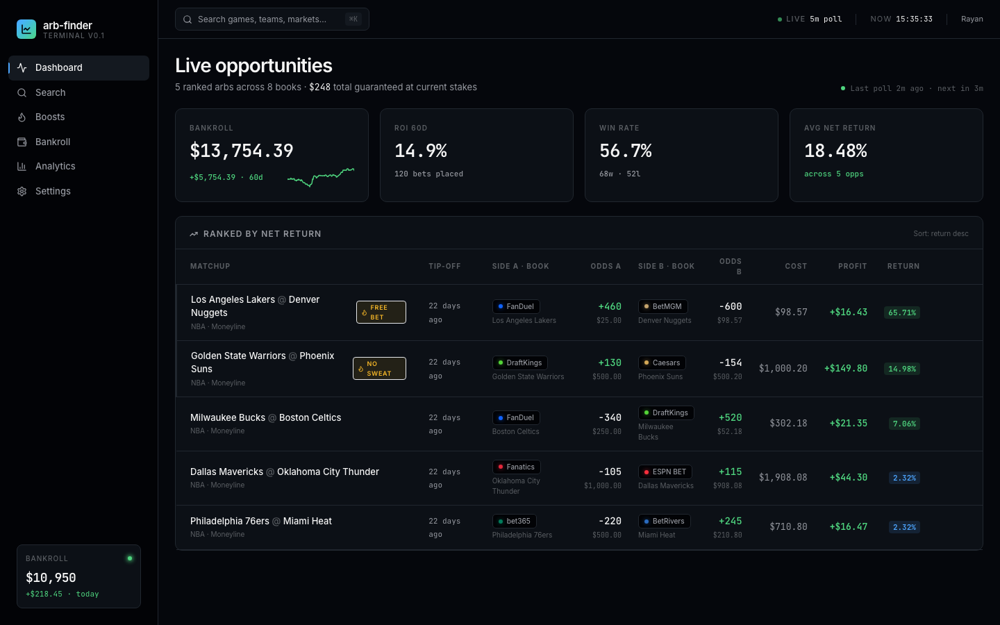
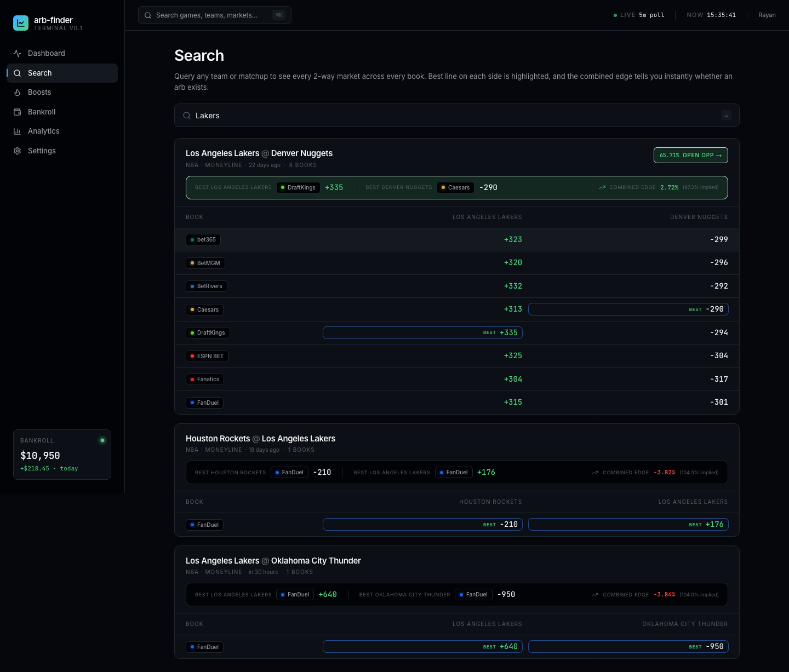
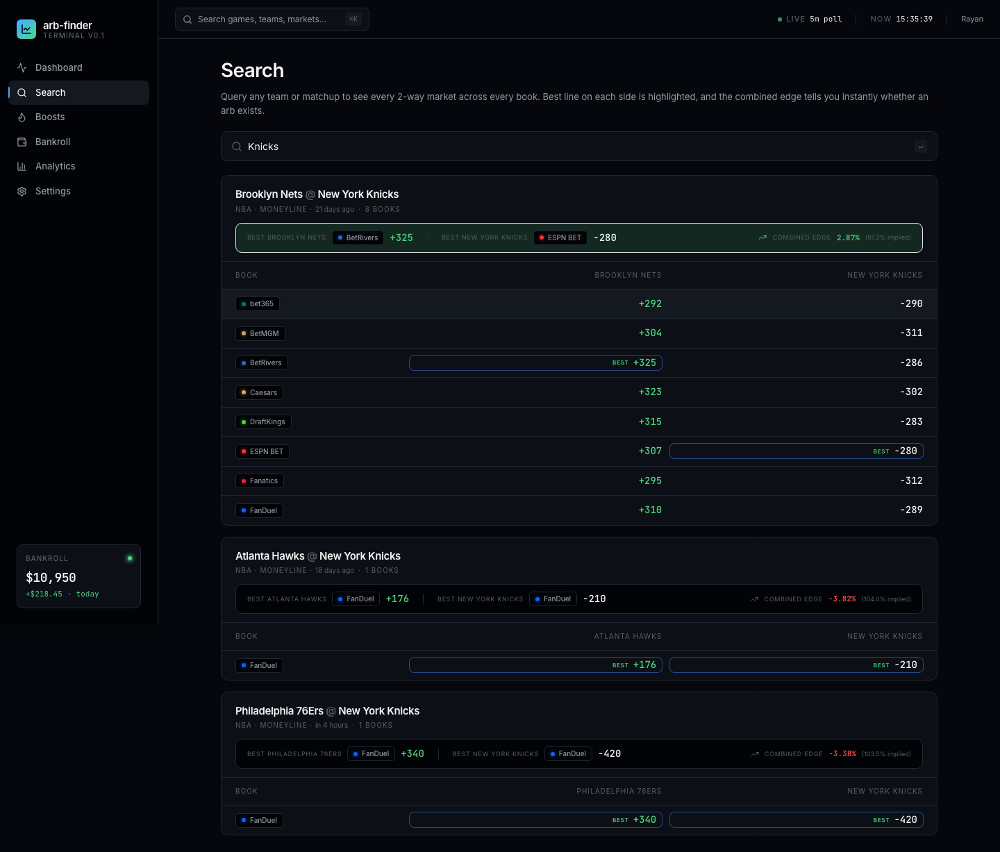
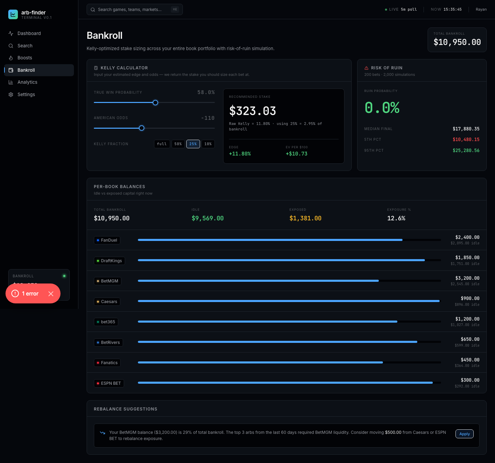
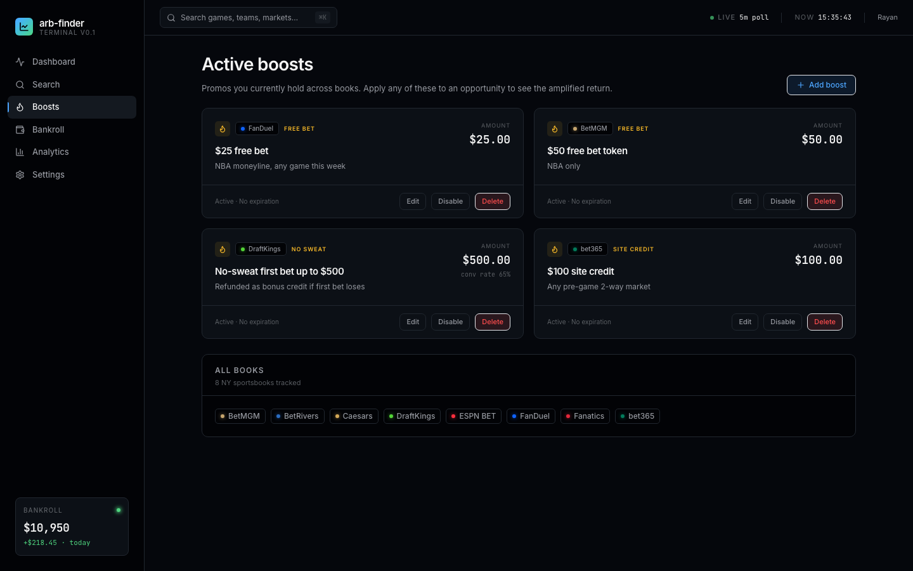
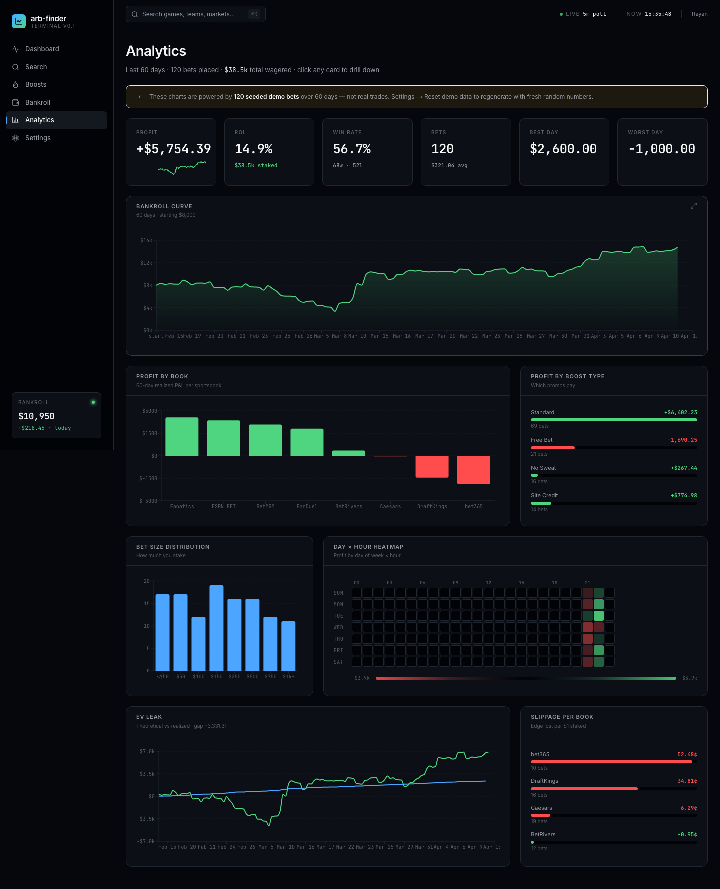
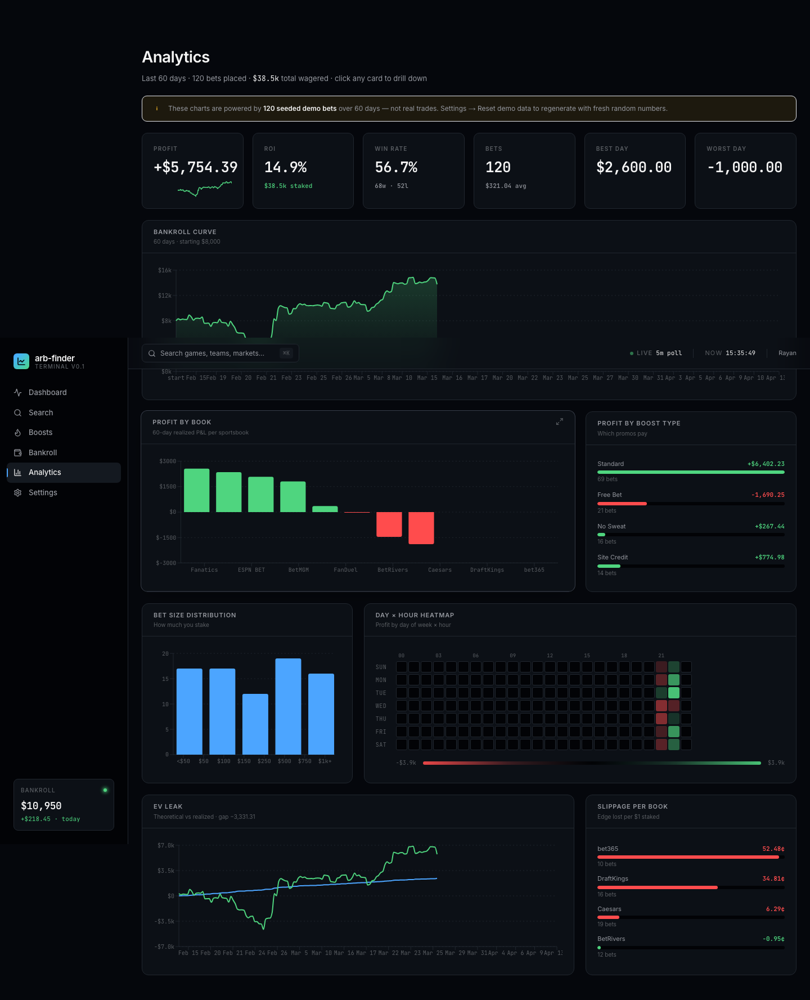
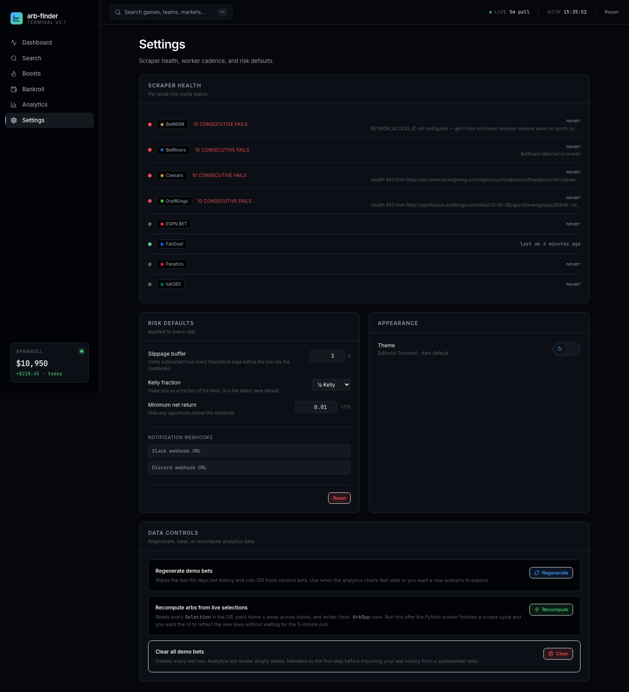

# arb-finder

Cross-book sportsbook arbitrage + promo-boost finder with Kelly bankroll optimization and a personal P&L analytics layer.

Replaces the manual Excel-calculator workflow of cross-referencing lines across every NY sportsbook with a dense, finance-terminal-style web UI that surfaces every profitable 2-way trade in real time, amplifies them with active promos (free bets, no-sweats, site credits, profit boosts), and one-clicks into the pre-filled bet slip on each book.

## Live walkthrough

The app running locally with real FanDuel NBA odds + seeded demo data.

**1. Dashboard — ranked arb opportunities across all 8 books**

5 live arbs ranked by net return. KPI strip shows bankroll, ROI, win rate, and avg return. Boost-amplified rows get an amber FREE BET / NO SWEAT badge.

**2. Dashboard filtered by sport**

URL-persisted sport/book/boost filters — shareable and browser-back-safe.

**3. Search — Lakers, pulling live FanDuel data**

Real FanDuel NBA lines for LA Lakers games. Best line on each side highlighted in green. Combined edge shown inline — green means arb exists, red means the book takes over.

**4. Search — Knicks**

Moneyline grid across all 8 NY sportsbooks. "65.71% OPEN OPP →" button jumps straight to the detail page.

**5. Bankroll — Kelly calculator + per-book balances**

Kelly calculator with full/½/¼/custom fraction. Risk-of-ruin simulator (5,000 runs, 200-bet horizon). Per-book idle vs exposed bars with rebalance suggestions.

**6. Boosts — active promo manager**

CRUD interface for tracking free bets, no-sweats, site credits, and profit boosts per book.

**7. Analytics — full P&L dashboard**

6 KPI cards (total profit, ROI, bets placed, win rate, avg EV, EV capture efficiency) + bankroll curve.

**8. Analytics — profit breakdowns and heatmaps**

Profit-by-book bars, profit-by-boost-type bars, bet-size histogram, day-of-week × hour profit heatmap, EV leak chart, slippage-per-book.

**9. Settings**

Theme toggle, Kelly fraction default, staleness thresholds, demo-data controls.

---

## Status

**Session 2 — live FanDuel scraper running.** Real NBA games flow in every 5 minutes via the Python worker. Full UI is live. The arb engine is feature-complete and Excel-parity tested (52 passing tests).

## What's working

- **Arb engine** (`packages/engine`) — 4 boost variants ported from Rayan's spreadsheet with improvements:
  - `arbStandard` — classic 2-way hedge, matches the `calc` sheet
  - `arbFreeBet` — generalized payout formula that works for both + and − odds on the free-bet side (Excel only handled + correctly)
  - `arbNoSweat` — configurable cash-rate, optimal hedge instead of the Excel's wrong-direction formula
  - `arbSiteCredit` — matches `bet365 trade` with a $100 boost baked into cost basis
  - `kelly` + `fractionalKelly` + `simulateRiskOfRuin` (Monte Carlo)
- **Dashboard** — ranked live arb table with KPI strip, boost highlighting, staleness indicator
- **Opportunity detail** — client-side bankroll slider recomputes stake splits instantly, boost picker applies any of 4 promo types, deep-link place-trade buttons
- **Search** — free-text team query returns every 2-way market across every book
- **Boosts** — manage active promos per book
- **Bankroll** — Kelly calculator with ¼/½/full sliders, per-book idle vs exposed, rebalance suggestions, live risk-of-ruin simulation (2000 sims × 200 bets)
- **Analytics** — 6 KPI cards + bankroll curve + profit-by-book + profit-by-boost + bet-size histogram + day/hour heatmap, 60 days of seeded history

## Stack

- Next.js 15 App Router + React 19 + TypeScript strict
- Tailwind CSS v3 with OKLCH design tokens
- Prisma + SQLite (Postgres in prod via `DATABASE_URL`)
- Radix UI primitives (fully restyled — not shadcn defaults)
- Recharts for analytics visualizations
- Vitest for the engine test suite

Monorepo layout:

```
arb-finder/
├── apps/web/             # Next.js app
├── packages/engine/      # TS arb math — 52 tests, Excel-parity
├── db/                   # Prisma schema + seed
└── scrapers/             # Python scrapers (session 2+)
```

## Design direction

**Editorial Terminal.** Dense, dark, typographic. Bloomberg-meets-Linear. Every number uses tabular numerals via JetBrains Mono. Real OKLCH palette, not default slate-gray. Boost-amplified opportunities get an amber left-border and highlight treatment so they pop without shouting. Not a template, not shadcn defaults.

## Running locally

```bash
pnpm install

# Create the SQLite DB and seed it
DATABASE_URL="file:$PWD/db/dev.db" pnpm --filter web exec prisma db push --schema=db/schema.prisma
cd apps/web && pnpm seed && cd ../..

# Dev server
pnpm --filter web dev
# → http://localhost:3000

# Run the engine test suite
pnpm --filter @arb/engine test
```

> SQLite path must be **absolute** in `apps/web/.env` — Prisma resolves file URLs differently for the CLI (relative to schema) and runtime client (relative to cwd), so absolute paths avoid the mismatch.

## Math fidelity

The engine ships two modes:

1. **Excel parity** — every function has unit tests that reproduce the exact outputs of the original spreadsheet cells to 4+ decimal places of precision
2. **Improved** — six fixes on top of Excel parity:
   - Free-bet formula generalized to work for any American odds on either side
   - Rounding kept at full precision internally, only rounded on display
   - No-sweat cash rate parameterized (not hardcoded to 0.65)
   - No-sweat hedge formula corrected to truly equalize both outcomes
   - Max-stake enforcement per book+market (in schema, wired in session 2)
   - `min_profit` vs `expected_profit` distinguished — for a true arb the guaranteed worst-case profit is what matters, not the probability-weighted EV

## What's coming in session 2+

- Python scrapers for FanDuel, DraftKings, BetMGM, Caesars, BetRivers (public JSON endpoints, no login needed)
- Event matcher across books (canonical keys + team alias tables + fuzzy time match)
- Live poller on a 5-min cadence
- Chrome extension for bet-slip autofill when deep links don't cover a book
- Vercel + Neon deploy
- Excel history import for real P&L
- bet365 / Fanatics / ESPN BET via Playwright (flakiest, lowest priority)

## Personal project

This is Rayan's personal replacement for a manual sportsbook-comparison workflow. Not distributed, not productized. Scraping respects personal-use boundaries.
